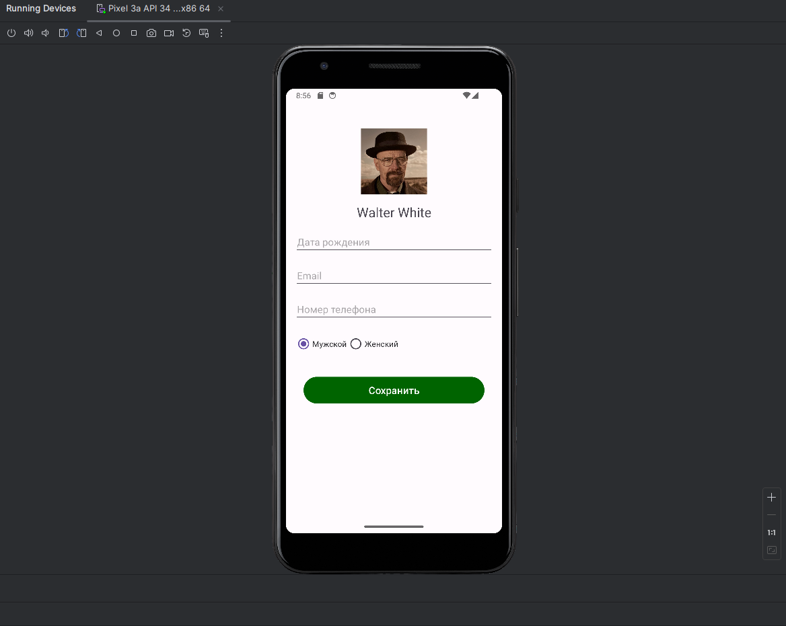
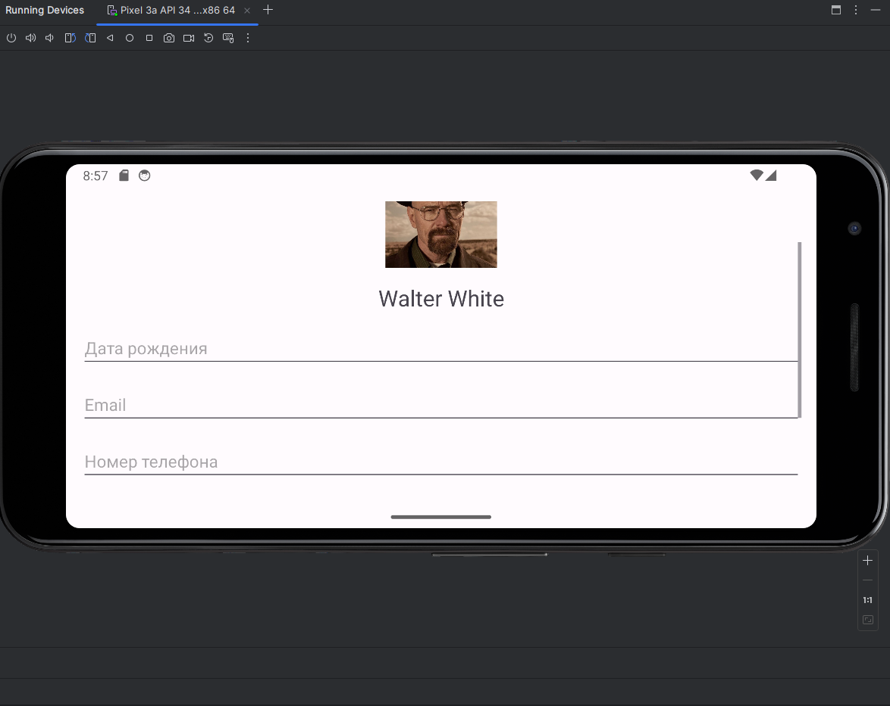
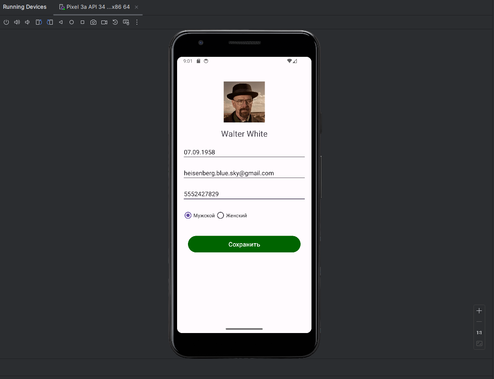
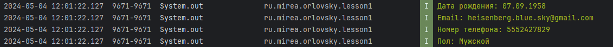

# WW contact updater

Этот проект представляет собой простое приложение для Android, разработанное с использованием Java и Android SDK. Приложение позволяет пользователям вводить и сохранять личные данные.

## Содержание

- [Экраны приложения](#экраны-приложения)
  - [Экран ввода данных](#экран-ввода-данных)
  - [Горизонтальный режим](#горизонтальный-режим)
  - [Пример заполненных данных](#пример-заполненных-данных)
  - [Вывод данных](#вывод-данных)

## Экраны приложения

### Экран ввода данных

На этом экране пользователь может ввести свои личные данные, используя различные поля ввода.

### Горизонтальный режим

Приложение также поддерживает горизонтальный режим, обеспечивая удобство использования на устройствах с широким экраном.

### Пример заполненных данных

Пример заполненных данных в приложении, где пользователь ввел свои личные данные.

### Вывод данных

После сохранения данных приложение выводит информацию в консоль для проверки и отладки.

