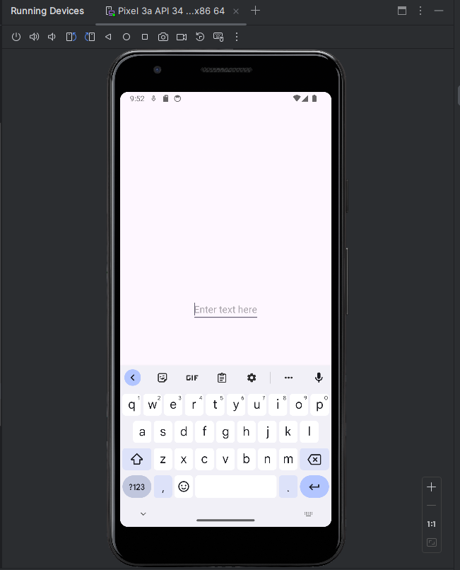
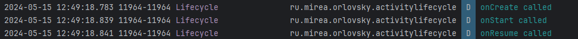
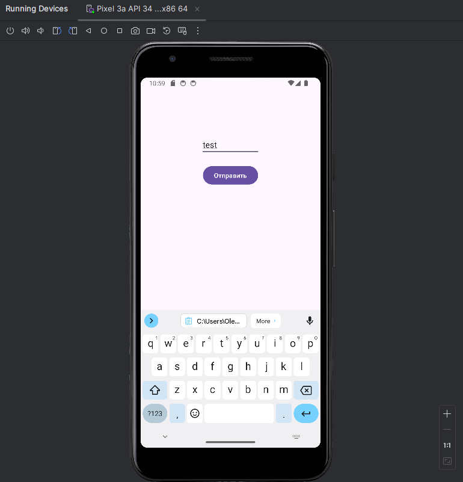
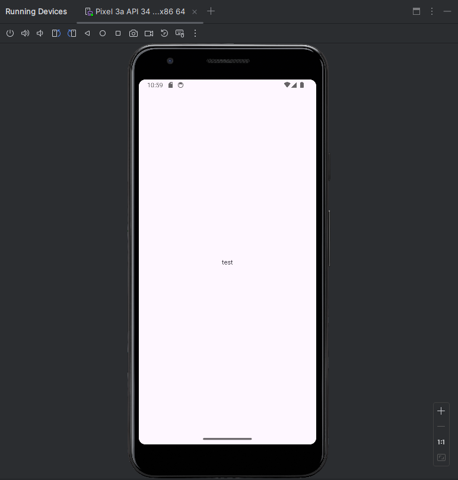
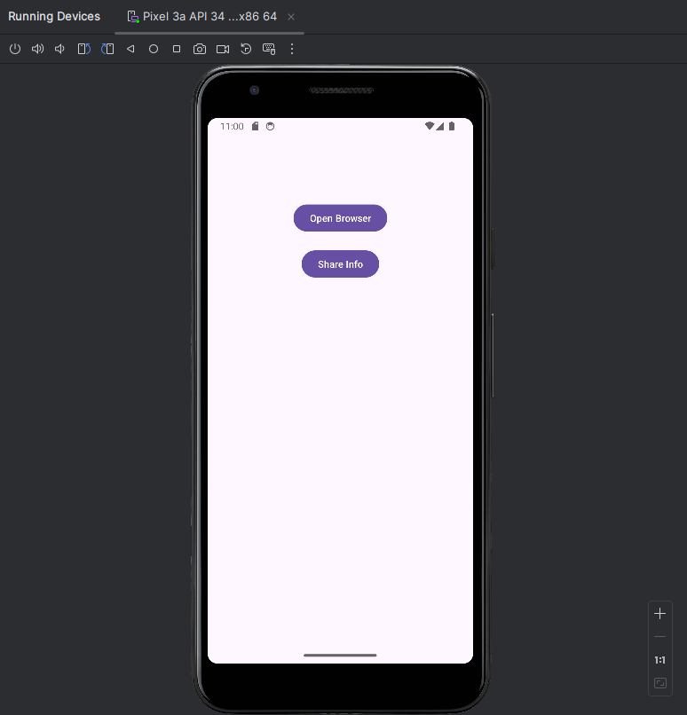
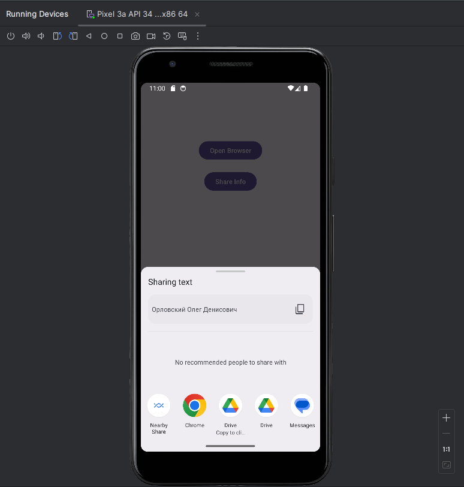
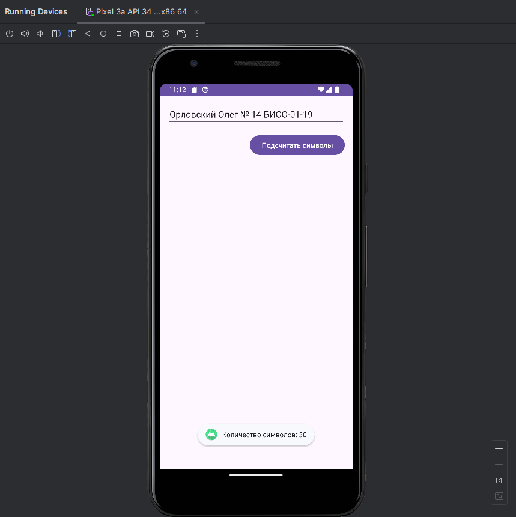
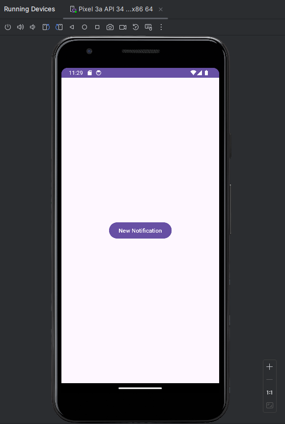
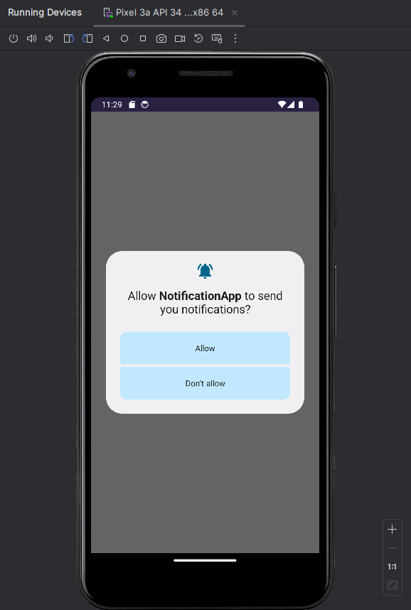
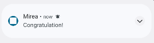

# WW contact updater

Этот проект представляет собой простое приложение для Android, разработанное с использованием Java и Android SDK.

## Содержание

- [Задания](#задания)
  - [Отладка приложений](#отладка-приложений)
  - [Многооконные приложения](#многооконные-приложения)
  - [Веб-страница](#веб-страница)
  - [Диалоговые окна](#диалоговые-окна)
  - [Уведомления](#уведомления)
  

## Задания

### Отладка приложений

Стартовая страница приложения

Вывод Logcat

### Многооконные приложения

Стартовая страница многооконного приложения

При нажатии на кнопку "Отправить", введенный текст появляется на втором экране

### Веб-страница

Стартовая страница приложения, которое открывает веб страницу mirea.ru при нажатии на кнопку "Open Browser"

При нажатии на кнопку "Sharing text", можно поделиться ФИО ученика

### Диалоговые окна

Подсчет символов введенного пользовательского текста, путем показа всплывающей подсказки

### Уведомления

Стартовая страница приложения, показывающее уведомления

Запрос на доступ уведомлений. В случае отказа будет выведена всплывающая подсказка

Пример уведомления, которое показывается пользователю

